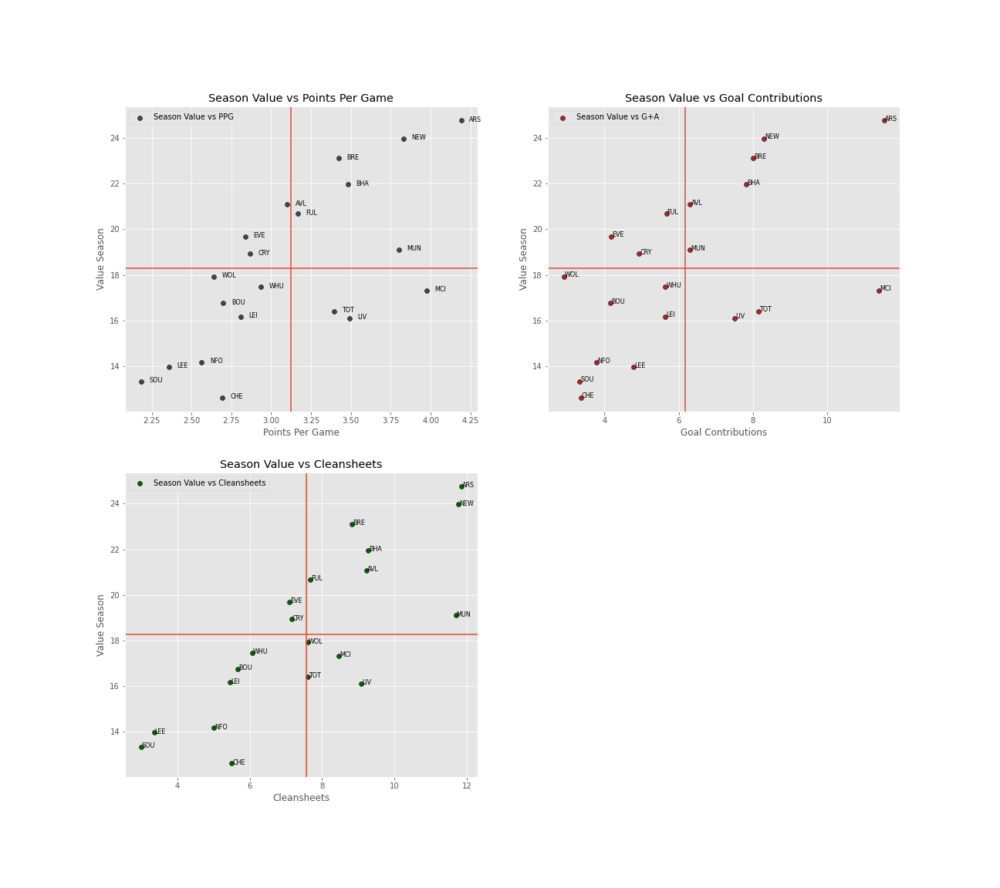
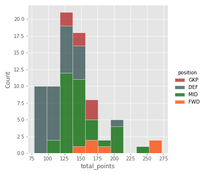
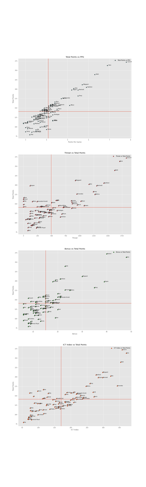

# Fantasy Premier League 2022/2023 Season Analysis:

## Project Description:
**About the game**: Fantasy Premier League (FPL) is a game played by 8m+ people globally and points are scored based on real-life outcomes in the English Premier League. Each FPL manager is given a starting budget of £100 million and must pick a total of 15 players: two goalkeepers, five defenders, five midfielders and three forwards. You are limited to a maximum of three players from each Premier League team. Players in your team score points based on real-life performances with the main contributors to points totals being goals, assists (attacking returns) and cleansheets (defensive returns).

The FPL team provides multiple API endpoints to get various stats on teams, players, FPL managers and the game itself. We are only concerened with player data so we will be consuming the https://fantasy.premierleague.com/api/bootstrap-static/ endpoint.

The question that we are trying to answer is: **Can we use data analytics to help us find undervalued players?**

Why undervalued? These are the players that I believe will elevate you from an average FPL manager to one of the top FPL managers. We will analyze teams, positions and players to give us insight into where and how to find these players. 

## Table Of Contents:

The project includes two Jupyter Notebooks and a folder containing raw aand clean data sorted by season:

1. Data Loading & Preprocessing

2. Exploratory Data Analysis

A summary of the tasks completed and findings are listed below. The notebooks provide more insights into the thought process and workflow. 

## 1. Data Loading & Preprocessing

### Data Loading
- import libraries
- read data from csv file

### Data Cleaning & Preparation
- choose only useful columns
- check and cast data types
- check and remove duplicate 
- discretinization and binning
- handling missing data

## 2. Eploratory Data Analysis
The goal of this exploratory data analysis is to derive insights into which metrics contribute to high points totals. The FPL API provides the same statistics that are available on the transfer page. I have added extra attributes to aid in my analysis during the preprocessing stage.

What are we interested in?
- High performing teams 
- High performing positions
- High performing players
- Undervalued players

Both attacking and defensive attributes will be taken into account when looking at the above constraints.

High performance will be measured mainly in points per game, total points, value over a season, goals scored, assists, clean sheets, saves, bonus points and G+A (goals and assists combined). Different stats matter depending on the players position and this will be taken into account.

Ranking the best attacking teams by goals + assists and the best defensive teams by cleansheets:

The bar charts provide some useful insights on which teams performed well over the 2022/2023. A high performing team is most likely to include high performing players by virtue of goal contributions and defensive contributions which are the cornerstone for picking players. These are the teams where will choose our base squad from which will have our long-term and premium players.

- **Attack**: Chelsea, Liverpool, Man City, Spurs, and West Ham were the only clubs to provide more than 100 combined goals and assists.
- **Defence**: Man City, Liverpool, Spurs, Chelsea and Arsenal were the only clubs to provide more than 125 total cleansheets.

Season value vs total points:  

The uppermost right quandrant in each scatter plot contains the best value & high-performing teams in each statistical category. These are the teams where we would like to choose our base squad from, which will have our long-term and premium players. We have already identified Liverpool, Chelsea, Man City, Spurs, Arsenal and West Ham as teams that fit this criteria which is why they will be ignored in this section. 

The uppermost left quadrant is the quadrant of interest as this is where the differentials and undervalued players are most likely to come from. These would most likely be teams that are not in the Top 6.

- **Upper left/Undervalued Teams**: West Ham, Aston Villa, Crystal Palace, Brentford, and Wolves would have provided good differentials last season.

Distribution of points by position:  

The key takeways from this plot is the heights of the bars. The more times a position's total points is accounted for within a certain range of values, the greater the height of bar.

- The positions with the majority of high performing players were in the Midfield and Defense.
- Midfielder and Defenders also dominate season points totals greater than 150. Investing heavily in these positions would have yielded great returns over the season. These positions would have been great for long-term investments.
- There were only a few high performing Forwards and Goalkeepers to choose from last season. These positions would have been great for short-term investments based on form or fixtures.
- The outliers in terms of season points totals (> 250 pts) were  Midfielders, which again shows the great points potential that the midfield had last season.

This plot allows us to find undervalued players at a glance:

## Conclusion:

- We identified Liverpool, Chelsea, Man City, Spurs, Arsenal and West Ham as the best performing teams 
- Aston Villa, Crystal Palace, Brentford, and Wolves were identified as the teams with the best differentials last season.
- High investments in the defense and midfield would have yielded the best returns over the course of last season.
- Liverpool had the most high performing players in three out of four generated squads.
- Salah and Son were by far the best performing players last season across our four metrics.
- **Cash, Gallagher, Toney, Coady, Sa and Ward-Prowse were some of the best undervalued picks of the season.**

### To view the code and for more visualizations please check out the notebooks!
